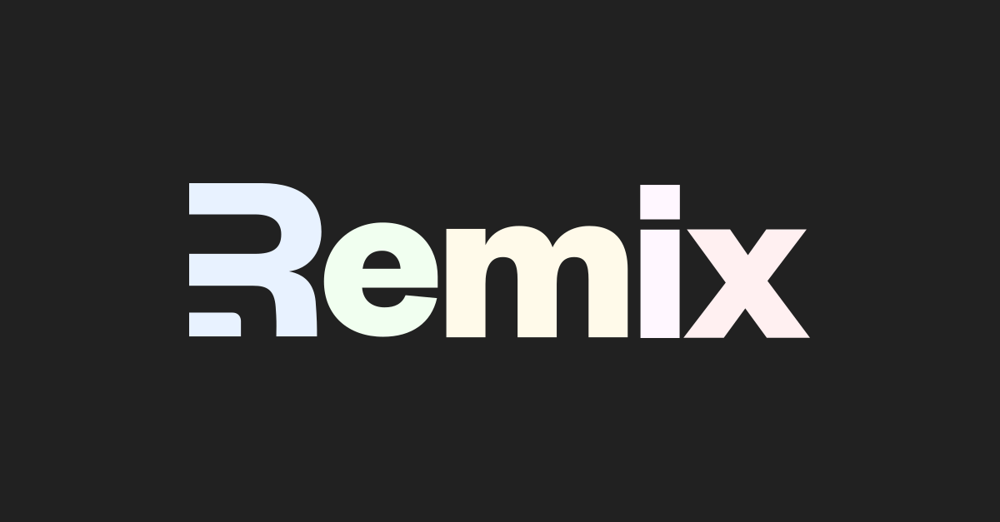

# Hi, there! My name is Prince 👋

Design and full-stack engineer advocating for type safety throughout the development process. Using static types on both the frontend (FE) and backend (BE) necessitates type enforcement on the API layer, making GraphQL a natural choice for its strong typing capabilities.

## My Tech Stack

Here are the tools I reach for to bring ideas to life:

* **Frontend:**
  * [React](https://react.dev/) 
  * [Remix](https://remix.run/) 
  * [Tailwind CSS](https://tailwindcss.com/) 
* **Backend:**
  * [Go](https://go.dev/) 
  * [Entgo](https://entgo.io/) 
  * [Graphql](https://entgo.io/) 
* **Bonus:** Used to be a die-hard fan of CSS-in-JS (PandaCSS)
